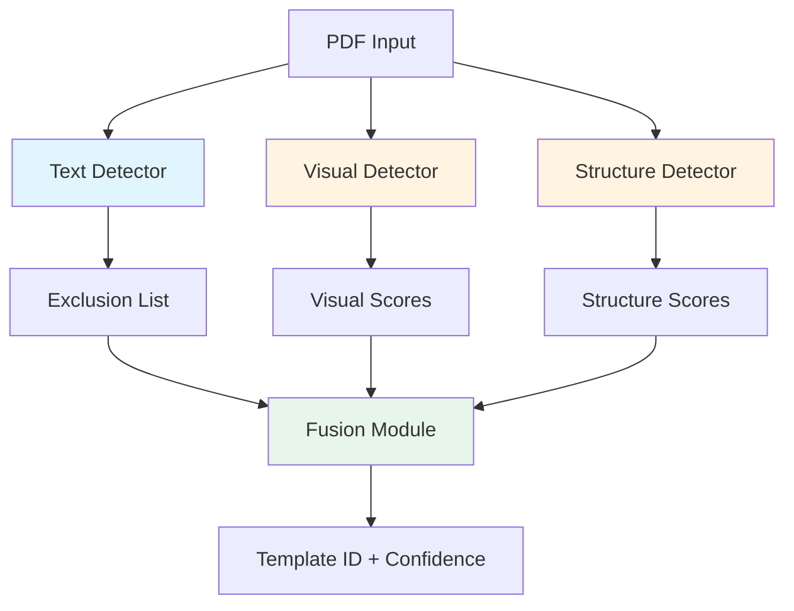

# PDF Classifier Architecture and Expansion Guide

## How the PDF Classifier Works

The `pdf_classifier` uses a **multi-modal fusion approach** with three detection methods:

### Detection Pipeline




### 1. Text Detector (`text_detector.py`) - EXCLUSION ONLY

- **Purpose**: Filters out templates that definitely don't match
- **Method**: Extracts text from first page, normalizes Persian text, checks for exclusion keywords
- **Output**: List of template IDs to exclude
- **Note**: Not used for positive identification, only exclusion

### 2. Visual Detector (`visual_detector.py`) - PRIMARY (60% weight)

- **Purpose**: Compares visual appearance of PDF regions
- **Method**:
  - Renders first page at 300 DPI
  - Extracts 3 regions: `header` (top 25%), `main_table` (middle), `payment_info` (bottom)
  - For each region, calculates:
    - **Image hashes**: pHash (35%), dHash (30%), aHash (20%), wHash (15%)
    - **Histogram correlation**: Statistical comparison (25%)
  - Combines region scores with weights: header (40%), main_table (35%), payment_info (15%)
- **Output**: Dictionary of `template_id -> visual_confidence` (0.0 to 1.0)

### 3. Structure Detector (`structure_detector.py`) - PRIMARY (40% weight)

- **Purpose**: Compares document structure and layout
- **Method**:
  - Extracts structural features:
    - Page count, dimensions, aspect ratio, orientation
    - Table count and main table structure (rows/columns)
    - Section presence (header, consumption_table, payment_info)
    - Layout (single/two-column)
  - Compares with template signatures using weighted matching:
    - Page structure (20%)
    - Table structure (50%)
    - Sections (25%)
    - Layout (5%)
- **Output**: Dictionary of `template_id -> structure_confidence` (0.0 to 1.0)

### 4. Fusion Module (`fusion.py`)

- **Purpose**: Combines all detection results
- **Method**:
  - Removes excluded templates
  - Calculates weighted fusion: `visual_score * 0.6 + structure_score * 0.4`
  - Checks confidence threshold (default: 0.5)
  - Returns best match or "unknown_template"

### Template Signature Format

Templates are stored as JSON files in `pdf_classifier/templates_config/signatures/template_X.json`:

```json
{
  "template_id": "template_X",
  "template_file": "path/to/template.pdf",
  "signatures": {
    "visual": {
      "regions": {
        "header": {
          "bbox_norm": [0.0, 0.0, 1.0, 0.25],
          "hashes": {
            "phash": "...",
            "dhash": "...",
            "ahash": "...",
            "whash": "..."
          },
          "histogram": [256 values]
        },
        "main_table": { ... },
        "payment_info": { ... }
      }
    },
    "structural": {
      "num_pages": 1,
      "page_dimensions": [width, height],
      "aspect_ratio": 0.707,
      "orientation": "portrait",
      "tables": { "count": 2, "main_consumption": {...} },
      "sections": { "header": {...}, ... },
      "layout": { "column_layout": "two_column", ... }
    },
    "text": {
      "exclusion_keywords": [],
      "unique_text_patterns": []
    }
  }
}
```

## How to Expand the Classifier

### Option 1: Add New Templates (Your Current Goal)

**Steps to add a new template:**

1. **Create signature JSON file**
  - Location: `pdf_classifier/templates_config/signatures/template_N.json`
  - You'll need to generate signatures from a reference PDF
2. **Generate signatures** (requires a signature generation script):
  - Extract visual signatures (hashes, histograms for each region)
  - Extract structural signatures (page info, tables, sections, layout)
  - Define text exclusion keywords (if needed)
3. **Test the new template**
  - Use `example_usage.py` to test classification
  - Verify confidence scores are reasonable

**Current Limitation**: The codebase appears to have signature generation logic elsewhere (not in this package). You may need to:

- Find/create a signature generation script
- Or manually create signatures based on the JSON format

### Option 2: Improve Detection Accuracy

**Potential improvements:**

1. **Adjust fusion weights** in `fusion.py`:
  - Current: visual (60%), structure (40%)
  - Could be tuned based on your data
2. **Enhance visual detection** in `visual_detector.py`:
  - Add more hash algorithms
  - Improve region extraction (currently uses fixed coordinates)
  - Add feature matching (SIFT/ORB) - currently commented as "not implemented"
3. **Enhance structural detection** in `structure_detector.py`:
  - Improve table detection accuracy
  - Add more structural features (fonts, colors, etc.)
  - Better section detection
4. **Add text-based positive matching** (currently only exclusion):
  - Could add positive text patterns for identification
  - OCR-based text matching

### Option 3: Add New Detection Features

**Possible additions:**

1. **OCR Text Matching**: Use OCR to extract and match text patterns
2. **Font Analysis**: Detect and compare font families/sizes
3. **Color Analysis**: Compare color schemes/logos
4. **Multi-page Analysis**: Currently only uses first page
5. **Metadata Analysis**: PDF metadata, creation date, etc.

### Option 4: Performance Improvements

**Current optimizations:**

- In-memory caching (images, regions, template DB)
- LRU cache for template loading

**Potential improvements:**

- Parallel processing (currently disabled)
- Disk-based caching for large batches
- Early exit optimizations
- GPU acceleration for image processing

## Files to Modify for Expansion

### Adding Templates

- `pdf_classifier/templates_config/signatures/template_N.json` - New signature file

### Improving Detection

- `pdf_classifier/visual_detector.py` - Visual matching algorithms
- `pdf_classifier/structure_detector.py` - Structural feature extraction
- `pdf_classifier/fusion.py` - Fusion weights and logic
- `pdf_classifier/text_detector.py` - Text-based matching (if adding positive matching)

### Adding Features

- Create new detector module (e.g., `font_detector.py`, `ocr_detector.py`)
- Integrate into `pdf_classifier/__init__.py` in `detect_template()`
- Update `fusion.py` to include new scores

## Next Steps

To proceed with adding templates, I need to know:

1. Do you have a signature generation script, or should we create one?
2. How many new templates do you wa

